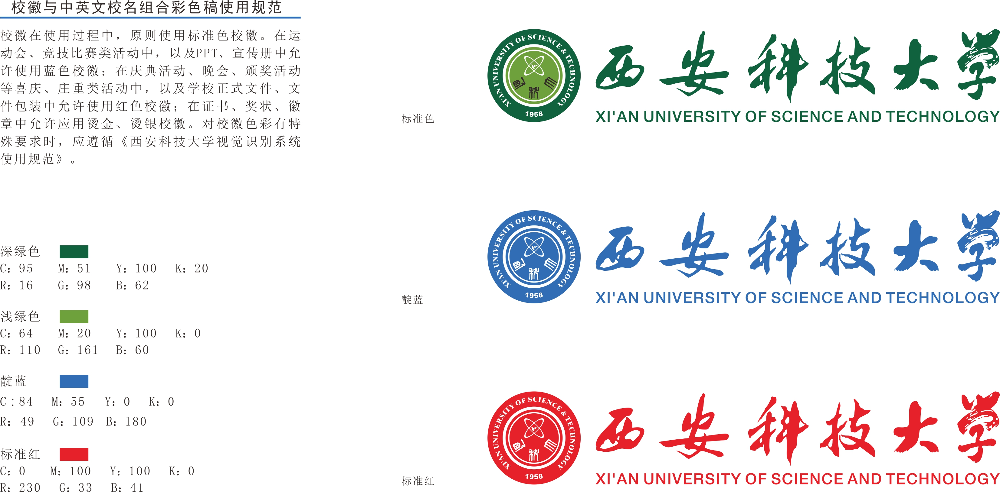
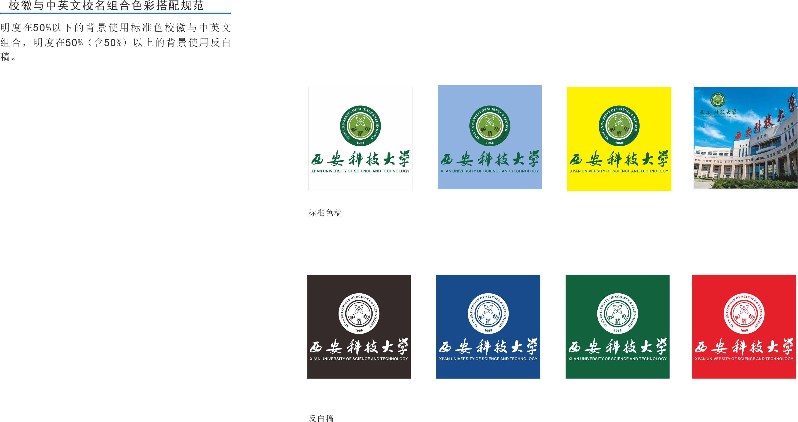

# 西安科技大学-宣传材料图片

这里主要是西安科技大学的宣传材料归档，包括了不同样式、颜色、附注的校徽和其他材料，以及部分印刷物品的样式。

后面会补充其他样式。

# XUST-Official-Publicity-Images

Here is primarily an archive of promotional materials from Xi'an University of Science and Technology, including various styles, colors, annotated logos, and other materials, as well as samples of some printed items.

Other styles will be added later.

# 样例 / Samples
## 校徽色彩色彩值（CMYK、RGB）

## 彩色稿反白稿使用规范

# 版权 / Copyright
源文件下载自学校官网。仅供学习交流使用。